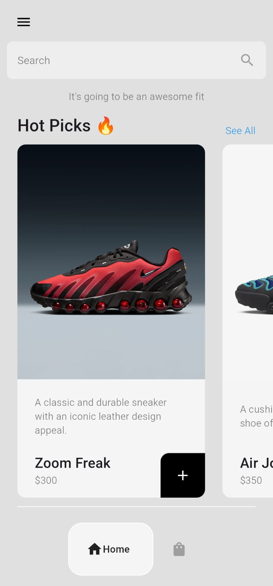
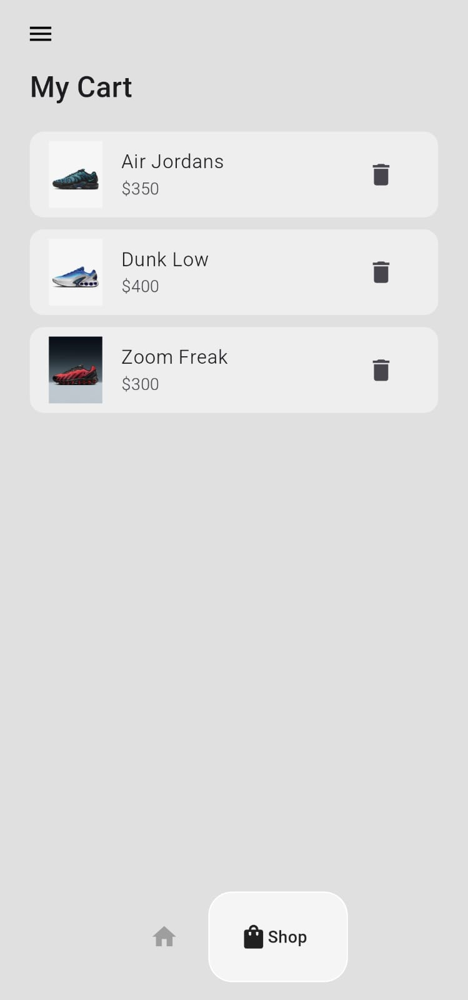

# Ecommerce-Sneakers-UI

Ecommerce-Sneakers-UI is a Flutter-based mobile application that provides a sleek and modern user interface for a sneaker e-commerce platform. This app offers users an intuitive and seamless shopping experience, showcasing a wide range of sneakers with detailed views and smooth navigation.

## Features

- **Product Listings**: Browse a curated collection of sneakers with high-quality images and descriptions.
- **Product Details**: View detailed information about each sneaker, including multiple images, price, and specifications.
- **Shopping Cart**: Add desired products to the cart and manage them with ease.
- **Responsive Design**: Ensures a consistent user experience across various devices and screen sizes.


## Screenshots

<p align="center">
  
  
  
</p>


## Getting Started

To run this project locally, follow these steps:

### Prerequisites

- Flutter SDK: [Install Flutter](https://docs.flutter.dev/get-started/install)
- Dart SDK: Included with Flutter
- An IDE with Flutter support (e.g., Android Studio, Visual Studio Code)

### Installation

1. **Clone the repository**:
   ```bash
   git clone git@github.com:Mahesh5726/Ecommerce-Sneakers-UI.git
   cd Ecommerce-Sneakers-UI
   ```


2. **Install dependencies**:
   ```bash
   flutter pub get
   ```


3. **Run the application**:
   ```bash
   flutter run
   ```


## Project Structure

The project follows a standard Flutter directory structure:

- **lib/**: Contains the Dart code for the application.
  - **main.dart**: Entry point of the application.
  - **screens/**: UI screens of the app.
  - **widgets/**: Reusable UI components.
  - **models/**: Data models representing the app's core entities.
  - **services/**: Classes handling data fetching and business logic.

## Dependencies

The project utilizes the following Flutter packages:

- **flutter/material.dart**: Standard Flutter material design library.
- **provider**: State management solution.
- **http**: For making HTTP requests.


## Contributing

Contributions are welcome! To contribute:

1. Fork the repository.
2. Create a new branch (`git checkout -b feature/your-feature-name`).
3. Commit your changes (`git commit -m 'Add some feature'`).
4. Push to the branch (`git push origin feature/your-feature-name`).
5. Open a Pull Request.

## Acknowledgements

- Inspired by various e-commerce UI designs and Flutter projects.
- Special thanks to the Flutter community for continuous support and contributions.

